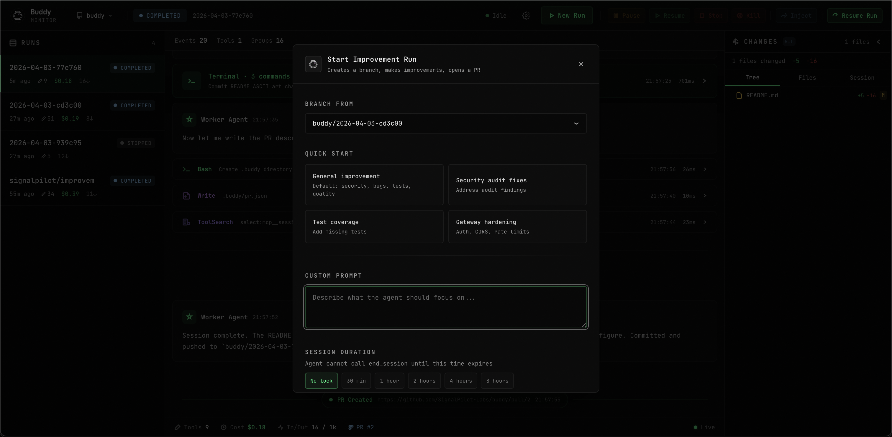
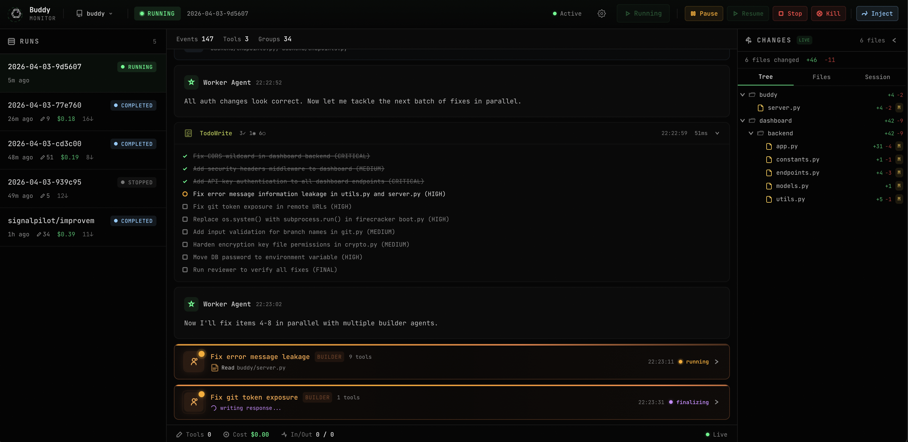

<div align="center">

<h1>AutoFyn</h1>

**Long-horizon agent that improves through expert iteration in context space.**

found 197 vulnerabilities across popular software · [improved the upper bound](https://github.com/Neehan/zhang-zagier-82a) for an open math problem · built the [#1 Spider 2.0 DBT agent](https://github.com/SignalPilot-Labs/SignalPilot)



<br/>



</div>

**[Getting Started](docs/user/getting-started.md)** · **[CLI](docs/user/cli.md)** · **[Remote Sandboxes](docs/user/remote-sandboxes.md)** · **[Config](docs/user/config.md)** · **[Custom Subagents](docs/user/custom-subagents.md)** · **[FAQ](docs/user/faq.md)**

---

AutoFyn works on goals that have verifiable rewards. For instance: find a working exploit against a live system. The agent proposes one, and it either fires or it doesn't. The final outcome is objective and not opinionated.

As a result, the agent frequently receives verified feedback instead of self-grading, which is gameable. And every round starts from an empty context, seeded only with what was written to disk, so nothing accumulates and nothing rots.

Either alone falls short. Clear the context but skip the verifier and each round reloads what the last one merely believed, compounding its own mistakes. Verify but let context grow and the agent rots before it finishes. Together, the agent starts clean every round and starts from facts, so it can work for hours instead of drifting. We found the pattern holds across domains: vulnerability finding, math research, and topping data-science benchmarks.

Give AutoFyn a repo, a goal, and a time limit. Walk away. Come back to a PR.

## Results

### Security audits

- **[Next.js](https://github.com/vercel/next.js)** — 8 vulnerabilities (1 High, 4 Medium, 3 Low). Responsibly disclosed via HackerOne. [CVEs](docs/cves.md#nextjs)
- **[pnpm](https://github.com/pnpm/pnpm)** — 7 vulnerabilities (1 High, 5 Medium, 1 Low), 3 exploit chains. Responsibly disclosed. [CVEs](docs/cves.md#pnpm)
- **[MetaMask Extension](https://github.com/MetaMask/metamask-extension)** — 12 vulnerabilities (3 High, 7 Medium, 2 Low), 3 exploit chains. Responsibly disclosed via HackerOne. [CVEs](docs/cves.md#metamask-extension)
- **[Warp](https://github.com/warpdotdev/Warp)** — 30 vulnerabilities (6 Critical, 7 High, 8 Medium, 9 Low), 3 exploit chains. Responsibly disclosed. [CVEs](docs/cves.md#warp)
- **[Langflow](https://github.com/langflow-ai/langflow)** — 22 vulnerabilities (3 Critical, 13 High, 6 Medium), 4 exploit chains. Responsibly disclosed. [CVEs](docs/cves.md#langflow)
- **[Hermes Agent](https://github.com/NousResearch/hermes-agent)** — 36 vulnerabilities (13 Critical, 22 High, 1 Medium), 18 exploit chains. Responsibly disclosed. [CVEs](docs/cves.md#hermes-agent)
- **[Agent TARS](https://github.com/bytedance/UI-TARS-desktop)** — 25 vulnerabilities (4 Critical, 18 High, 3 Medium), 20 exploit chains. Responsibly disclosed. [CVEs](docs/cves.md#agent-tars)
- **[RAGFlow](https://github.com/infiniflow/ragflow)** — 17 vulnerabilities (5 Critical, 11 High, 1 Medium), 5 exploit chains. Responsibly disclosed. [CVEs](docs/cves.md#ragflow)
- **[LiteLLM](https://github.com/BerriAI/litellm)** — 14 vulnerabilities (3 Critical, 4 High, 4 Medium, 3 Low), 2 exploit chains. Responsibly disclosed. [CVEs](docs/cves.md#litellm) · [Report](docs/audit_reports/litellm.md)
- **[Open WebUI](https://github.com/open-webui/open-webui)** — 12 vulnerabilities (4 Critical, 5 High, 3 Medium), 4 exploit chains. Responsibly disclosed. [CVEs](docs/cves.md#open-webui) · [Report](docs/audit_reports/open-webui.md)
- **[Twenty](https://github.com/twentyhq/twenty)** — 2 vulnerabilities (1 High, 1 Low), 1 exploit chain. Responsibly disclosed. [CVEs](docs/cves.md#twenty)
- **[Supermemory](https://github.com/supermemoryai/supermemory)** — 4 vulnerabilities (1 High, 3 Medium), 4 exploit chains. Responsibly disclosed via email to Supermemory.
- **[Phantom Connect SDK](https://github.com/phantom/phantom-connect-sdk)** — 8 vulnerabilities (5 Medium, 3 Low), 1 exploit chain. Responsibly disclosed. [CVEs](docs/cves.md#phantom-connect-sdk)

### Software engineering

- **[SignalPilot](https://github.com/SignalPilot-Labs/SignalPilot)** — built a data analysis agent from scratch, #1 on the [Spider 2.0 dbt benchmark](https://spider2-sql.github.io/).
- **[Caveman](https://github.com/tempcollab/caveman)** — optimized the prompt compression skill by +10% without quality loss ([write-up](https://github.com/tempcollab/caveman/blob/main/docs/improving-caveman-with-autofyn.md)).

### Math

- **[Zhang–Zagier height](https://github.com/Neehan/zhang-zagier-82a)** — improved the upper bound on the essential minimum (Tao's constant 82a) from Doche's 0.25443677 to a certified 0.2538893183, via a machine-searched ladder of adjoined blocks. Since superseded by [Gri26]'s 0.2536331090.

## Quick start

```bash
git clone https://github.com/SignalPilot-Labs/AutoFyn.git ~/.autofyn
pip install ~/.autofyn/cli
autofyn update && autofyn start
```

If your agent needs docker access, run

```
autofyn start --allow-docker
```

Two release channels:

- `autofyn update --branch production` — **stable** (recommended)
- `autofyn update --branch main` — **nightly** (latest features)

Open [localhost:3400](http://localhost:3400) for the dashboard. AutoFyn auto-detects your Claude token, GitHub token, and repo from your local git remote.

Pick a starter preset — **Security hardening**, **Bug sweep**, **Code quality**, or **Test coverage** — or write your own goal:

```bash
autofyn run new -p "Optimize the algorithm to hit 60% compression ratio without further quality loss" -d 120
```

To configure manually:

```bash
autofyn settings set --claude-token YOUR_KEY --git-token YOUR_TOKEN --github-repo owner/repo
```

## How it works

LLM agents that run in a loop hit three failure modes:

- **Context rot** — context grows until the model loses track.
- **No learning** — mistakes repeat because nothing carries between iterations.
- **No compass** — the agent can't tell whether it's making progress or going in circles.

AutoFyn's round loop addresses each one by simulating an [**expert iteration**](https://arxiv.org/abs/1705.08439) in LLM context space, not the weight space. Every round starts from an empty context window, seeded only with what was explicitly written to disk: `run_state.md` and the subagent memory files. From there the LLM proposes a plan and a build, an *expert* grades the raw proposal, and the verified outcome and the learnings are distilled back to those files for the next round to read. Unlike AlphaZero, the expert isn't a search — it's a metric that reviewer subagents run, such as a test suite or a benchmarking script. The key components of the system are:

- **State, not context.** Each round gets a clean context window. Cross-round knowledge lives in `/tmp/memory/` — `run_state.md` (goal, eval history, rules) and per-subagent rule files. Context never degrades because it never accumulates.
- **Objective reward signal.** Every round ends with a real eval: run the benchmark, execute the exploit, check the test suite. The signal is sparse and binary — a bound improves or it doesn't, an exploit fires or it doesn't — but it's grounded, not a model's opinion, and that's what the loop optimizes against. The result is appended to eval history so the orchestrator can track progress across rounds.
- **Policy updates from failures.** Reviewer findings and repeated mistakes become persistent Rules: `ALWAYS: run migrations before tests (because round 4 broke prod, round 4)`. Global rules are injected into every subagent. Per-subagent rules (e.g. `architect.md`, `code-reviewer.md`) let each subagent accumulate domain-specific knowledge across rounds.
- **Honest feedback loop.** Reviewers are independent. A round that improves the metric but violates a constraint is rejected. The agent corrects course instead of reinforcing bad decisions.
- **Time-locked episodes.** `end_session` is denied until the budget expires. It iterates toward the target for the full duration.
- **Custom subagents.** A repo can drop a `.autofyn/subagents.json` to bring its own subagents — adding new ones or overriding the shipped team by name — to tailor the pipeline to a domain (ML research, formal proofs, data work). See [Custom Subagents](docs/user/custom-subagents.md).

## CLI reference

```
# Services
autofyn start                          # start services
autofyn start --allow-docker           # start with Docker access for sandbox
autofyn stop                           # stop all services
autofyn update                         # pull latest code + images
autofyn update --branch main           # switch to nightly channel
autofyn update --image-tag abc1234     # pin to a specific version
autofyn update --build                 # force local build (for dev)
autofyn logs                           # stream container logs
autofyn kill                           # remove all containers
autofyn uninstall                      # remove everything (containers, images, ~/.autofyn)

# Runs
autofyn run                            # interactive run selector
autofyn run new -p "Fix auth bugs"     # start a new run
autofyn run list                       # list recent runs
autofyn run get <run_id>               # run details + action menu

# Settings
autofyn settings status                # check config
autofyn settings get                   # show all settings
autofyn settings set --claude-token TOKEN --git-token TOKEN --github-repo owner/repo

# Repos
autofyn repos list                     # list repos
autofyn repos set-active owner/repo    # set active repo
```

Use `--json` on any command for machine-readable output.

## Remote sandboxes

Runs can execute on remote machines (HPC clusters, GPU servers) instead of local Docker. AutoFyn SSH-tunnels to the remote, streams logs back, and manages the lifecycle automatically.

See [docs/user/remote-sandboxes.md](docs/user/remote-sandboxes.md) for setup, start command examples, GPU access, and troubleshooting.

## Responsible disclosure

All vulnerabilities were privately disclosed to maintainers before any public mention. Full reports are withheld until patches are available.

## License

AutoFyn is source-available under the [Business Source License 1.1](LICENSE). You may copy, modify, and make non-production use of the code freely; **any production or commercial use requires a commercial license**. Each released version automatically converts to the [Apache License 2.0](LICENSE-APACHE-2.0) three years after its release.

The Licensor is SignalPilot Inc. For commercial licensing, contact info@signalpilot.ai.

> Note: BSL is not an OSI-approved open-source license until it converts. Until then, AutoFyn is "source-available."

---

Built with the [Claude Agent SDK](https://docs.anthropic.com/en/docs/claude-code/sdk). Licensed under the [Business Source License 1.1](LICENSE).
